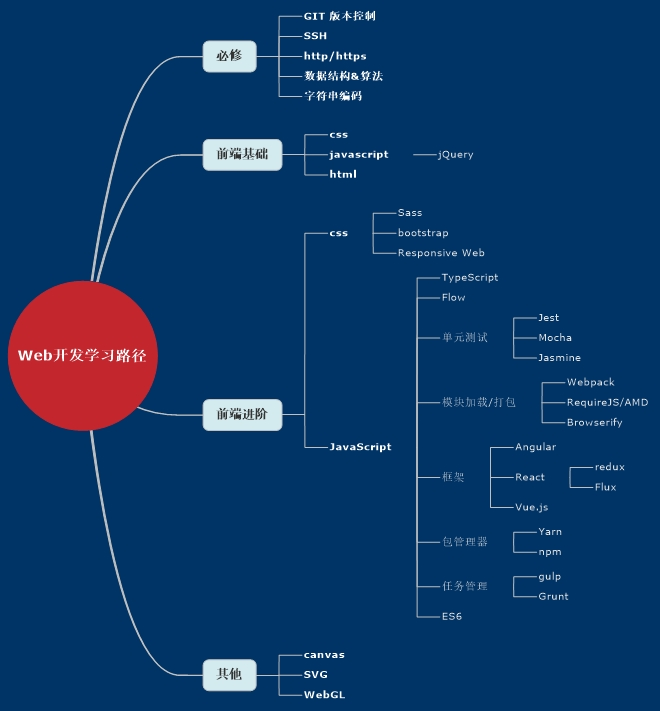

# 前端源码学习系列

## 序言
刚进入前端大半年左右的时间，发现前端需要掌握的知识点还是蛮多的。回顾过去在前端所做的工作，绝大部分时间都花在阅读使用手册上，虽然这确实能很好的满足大部分业务需求，但仍然觉得还是不够，希望能更进一步，做到知其然，更知其所以然。最近在github上看到[developer-roadmap](https://github.com/kamranahmedse/developer-roadmap)库，其给开发者规划好了不错的学习路径。初步打算按照该roadmap做学习，并且坚持每天都github上记录一点学习的内容。

## 目前的学习点
团队使用react-redux-webpack技术，因此将围绕该技术生态开始学习。第一站是redux源码的学习，其他知识点也可能围绕redux的源码学习而展开。

